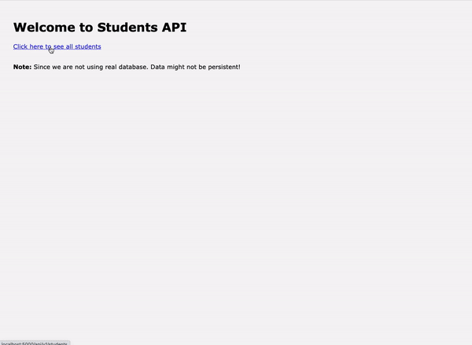

# Students CRUD

## Routes

| CREATE             | READ             | READ ONE           | UPDATE              | DELETE           |
| ------------------ | ---------------- | ------------------ | ------------------- | ---------------- |
| Create new student | Get all students | Get single student | Update student info | Delete a student |
| /new               | /                | /:id               | /edit/:id           | /delete/:id      |
| push()             | students         | find()             | find(), findIndex() | find(), filter() |


## Commands
- `npm install` && `npm run dev`


## Probable Output of this Exercise



## Stretch Challenges

- Improve error handling in client side `(/views)` folder
- Implement custom **middlewares** to check if `req.body` is correct or `id` is an actual **integer**
- Ex:
```js
    function mustBeInteger(req, res, next) {
        const id = req.params.id;

        if (!Number.isInteger(parseInt(id))) {
            res.status(400).json({ message: 'ID must be an integer' });
        } else {
            next();
        }
    }
```

## Feedbacks

- For any feedbacks/suggestions, send a slack message to instructor!